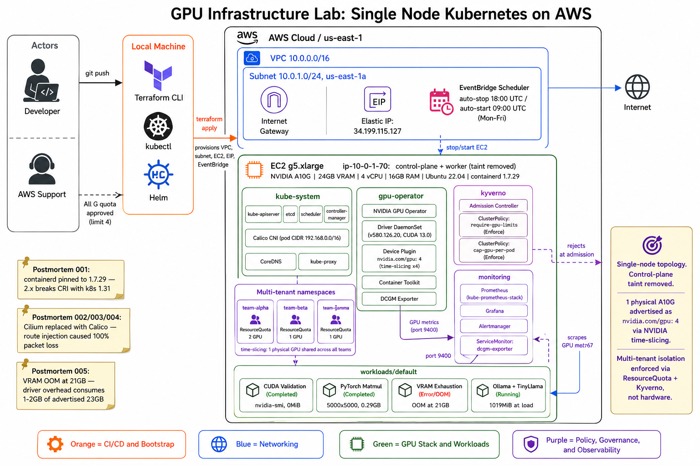

# gpu-infra

Single-node Kubernetes GPU infrastructure lab on AWS. Built from scratch using kubeadm and Terraform to understand the full stack real bootstrapping, real failures, real postmortems.

---

## What Was Built

GPU infrastructure environment on a single AWS g5.xlarge (NVIDIA A10G, 24GB VRAM) running Kubernetes 1.31. The cluster runs GPU workloads, enforces multi-tenant isolation via policy and quota, and exposes GPU metrics through Prometheus and DCGM.

---

## Repository Structure

```
GPU-Infra/
├── terraform/
│   ├── main.tf                        Single-node infrastructure (VPC, SG, EC2, EIP, scheduler)
│   ├── variables.tf                   Configuration (region, SSH CIDR, schedules)
│   ├── outputs.tf                     IPs and SSH commands
│   └── bootstrap-gpu-node.sh          Node bootstrap (containerd pinned to 1.7.29)
├── docs/
│   └── postmortems/
│       ├── 001-containerd-incompatibility.md
│       ├── 002-cilium-route-hijack.md
│       ├── 003-single-node-pivot.md
│       ├── 004-cni-migration-networking-collapse.md
│       └── 005-vram-exhaustion.md
├── policy/
│   ├── kyverno/
│   │   ├── require-gpu-limits.yaml    Reject pods without GPU resource limits
│   │   └── cap-gpu-per-pod.yaml       Cap GPU requests at 1 per pod
│   └── namespaces/
│       └── teams.yaml                 Multi-tenant namespaces with ResourceQuota
└── workloads/
    ├── cuda-samples/                  CUDA validation (nvidia-smi in pod)
    ├── pytorch-test/                  PyTorch matmul on A10G
    ├── vram-exhaustion/               Deliberate OOM postmortem
    └── ollama/                        TinyLlama inference workload
```

---

## Stack

| Component | Details |
|-----------|---------|
| Node | g5.xlarge — 4 vCPU, 16GB RAM, 50GB disk |
| GPU | NVIDIA A10G, 24GB VRAM (usable ceiling ~21GB) |
| OS | Ubuntu 22.04 LTS |
| Runtime | containerd 1.7.29 (pinned — 2.x breaks CRI with k8s 1.31) |
| Orchestrator | kubeadm 1.31.14 |
| CNI | Calico v3.27 |
| GPU stack | NVIDIA GPU Operator (driver 580.126.20, CUDA 13.0) |
| Policy | Kyverno (admission control, GPU limits enforcement) |
| Monitoring | Prometheus + Grafana + DCGM Exporter |
| IaC | Terraform >= 1.5 |
| Scheduler | EventBridge (auto-stop 18:00 UTC, auto-start 09:00 UTC) |

---

## Workload Results

| Workload | Result | VRAM |
|----------|--------|------|
| CUDA validation | nvidia-smi in pod, A10G confirmed | 0MiB |
| PyTorch matmul 5000x5000 | PASSED | 0.29GB |
| VRAM exhaustion | OOM at iteration 21 (21GB) | 22.06GB at crash |
| Ollama + TinyLlama | Inference working | 1019MiB at load |

---

## Policy Enforcement

Two Kyverno ClusterPolicies in Enforce mode:

**require-gpu-limits** — any pod requesting `nvidia.com/gpu` must set explicit resource limits. Rejected at admission:

```
admission webhook denied: Pods requesting nvidia.com/gpu must set explicit resource limits.
```

**cap-gpu-per-pod** — no pod can request more than 1 GPU slice.

---

## Multi-Tenant GPU Simulation

GPU time-slicing configured via NVIDIA GPU Operator:

```
1 physical A10G → nvidia.com/gpu: 4
```

Three team namespaces with ResourceQuota:

```
team-alpha: 2 GPU
team-beta:  1 GPU
team-gamma: 1 GPU
```

Quota enforcement test:

```
pods "beta-overflow" is forbidden: exceeded quota: gpu-quota,
requested: requests.nvidia.com/gpu=1,
used: requests.nvidia.com/gpu=1,
limited: requests.nvidia.com/gpu=1
```

---

## Quick Start

### Prerequisites

```bash
aws sts get-caller-identity
terraform version
aws ec2 describe-key-pairs --key-names gpu-infra
```

### Provision infrastructure

```bash
cd terraform
terraform init
terraform plan \
  -var="allowed_ssh_cidr=$(curl -s ifconfig.me)/32" \
  -var="key_name=gpu-infra"
terraform apply \
  -var="allowed_ssh_cidr=$(curl -s ifconfig.me)/32" \
  -var="key_name=gpu-infra"
```

### Bootstrap cluster

```bash
# Fix containerd config
sudo mkdir -p /etc/containerd
containerd config default | sudo tee /etc/containerd/config.toml
sudo sed -i 's/SystemdCgroup = false/SystemdCgroup = true/' /etc/containerd/config.toml
sudo systemctl restart containerd

# Initialize cluster
sudo kubeadm init \
  --pod-network-cidr=192.168.0.0/16 \
  --apiserver-advertise-address=<private-ip> \
  --control-plane-endpoint=<private-ip> \
  --skip-phases=addon/kube-proxy

# Set up kubeconfig
mkdir -p $HOME/.kube
sudo cp /etc/kubernetes/admin.conf $HOME/.kube/config
sudo chown $(id -u):$(id -g) $HOME/.kube/config

# Remove control-plane taint (single node)
kubectl taint nodes --all node-role.kubernetes.io/control-plane-

# Install Calico CNI
kubectl apply -f https://raw.githubusercontent.com/projectcalico/calico/v3.27.0/manifests/calico.yaml

# Verify
kubectl get nodes
```

### Install GPU Operator

```bash
helm repo add nvidia https://helm.ngc.nvidia.com/nvidia
helm repo update
helm install gpu-operator nvidia/gpu-operator \
  --namespace gpu-operator \
  --create-namespace \
  --wait \
  --timeout 15m

# Gate check
kubectl describe node | grep -A10 "Capacity:"
# Must show: nvidia.com/gpu: 1
```

### Run workloads

```bash
# 1. CUDA validation
kubectl apply -f workloads/cuda-samples/validate.yaml
kubectl logs cuda-validate

# 2. PyTorch test
kubectl apply -f workloads/pytorch-test/job.yaml
kubectl logs pytorch-test

# 3. VRAM exhaustion
kubectl apply -f workloads/vram-exhaustion/job.yaml
kubectl logs vram-exhaust

# 4. Ollama inference
kubectl apply -f workloads/ollama/deployment.yaml
kubectl exec -it ollama -- ollama pull tinyllama
kubectl exec -it ollama -- ollama run tinyllama "What is a GPU?"
```

### Apply policies

```bash
kubectl create -f https://github.com/kyverno/kyverno/releases/latest/download/install.yaml
kubectl apply -f policy/kyverno/
kubectl apply -f policy/namespaces/
```

---

## Key Decisions

**Why kubeadm, not EKS?**
Operational depth. Understanding every component, seeing the full failure surface, debugging from first principles.

**Why single node?**
Two-node architecture hit a persistent inter-node networking failure caused by Cilium route injection. Architecture simplified to single node to unblock GPU workload execution. See postmortems 002 and 003.

**Why Calico, not Cilium?**
Cilium injects a host route that redirects the entire node subnet through `cilium_host`, breaking node-to-node traffic before Cilium can initialize. Calico does not exhibit this behavior. See postmortem 002.

**Why containerd 1.7.29 pinned?**
containerd 2.x introduced CRI changes incompatible with Kubernetes 1.31. See postmortem 001.

**Why private IP for --control-plane-endpoint?**
EIP is unreachable from inside the VPC. kubelet uses the internal network to reach the API server.

---

## Postmortems

| # | Title | Root Cause |
|---|-------|------------|
| 001 | containerd 2.x CRI incompatibility | apt installed latest containerd, breaking kubeadm |
| 002 | Cilium route hijack | Cilium injected subnet route through cilium_host |
| 003 | Single-node pivot | Two-node inter-node networking unresolvable |
| 004 | CNI migration collapse | Cilium + Calico residual state partitioned pod network |
| 005 | VRAM exhaustion OOM | No GPU memory limit, driver overhead not accounted for |

Full postmortems: [docs/postmortems/](docs/postmortems/)

---

## Key Numbers

| Metric | Value |
|--------|-------|
| GPU | NVIDIA A10G |
| Total VRAM | 23028MiB |
| Usable VRAM ceiling | ~21GB |
| Time-slicing replicas | 4 |
| Postmortems | 5 |
| Workloads completed | 4 |
| Days to first working GPU pod | 3 |
| AWS credits used | $9.32 of $500 |

---

## Cost

| Resource | Running | Stopped |
|----------|---------|---------|
| g5.xlarge | $1.006/hr | $0 |
| EIP | $0.005/hr | $0.005/hr |
| **Total** | **~$1.01/hr** | **~$0.005/hr** |

EventBridge auto-stops the instance at 18:00 UTC and restarts at 09:00 UTC Mon-Fri.
